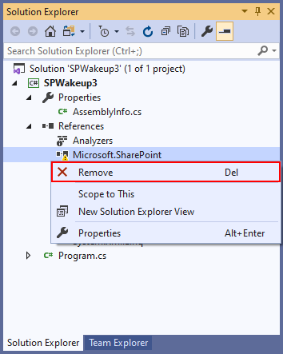
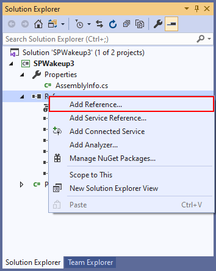
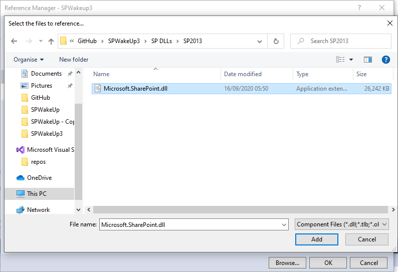
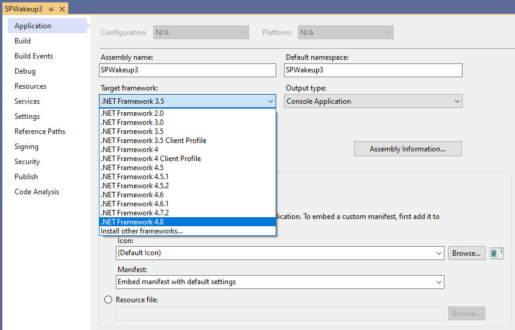

# Build SPWakeUp Yourself

The following are instructions to allow you to build SPWakeUp yourself (for example if you don't trust the binaries provided...)

## Pre-Requisites

You'll need the following to be able to build SPWakeUp:

- A copy of Visual Studio 2019. The community edition works fine.

- The source code. Grab a copy from https://github.com/Andy-Dawson/SPWakeUp/Assets/SPWakeup-VS2019-Source-v1.0.0.zip

- The 'Microsoft.SharePoint.dll' file from the version of SharePoint you want to build for. By default, this is located in 'C:\\Program Files\\Common Files\\microsoft shared\\Web Server Extensions\\\<version number>\\ISAPI\\' on each SharePoint server in the farm.

## Instructions

1. Extract the source code zip file. You should end up with a folder structure that looks like the top part of the following diagram:

```
C:\GITHUB\SPWAKEUP
|   SPWakeup3.sln
|
+---SPWakeup3
|   |   app.config
|   |   Program.cs
|   |   SPWakeup3.csproj
|   |   SPWakeup3.csproj.user
|   |
|   \---Properties
|           AssemblyInfo.cs
|
\---ExternalResources
    \---SharePointDLLs
        +---SP2013
        |       Microsoft.SharePoint.dll
        |
        +---SP2016
        |       Microsoft.SharePoint.dll
        |
        \---SP2019
                Microsoft.SharePoint.dll
```

2. If you want to build SPWakeUp for multiple versions of SharePoint, create a structure to store the dll files in. I use a structure as shown in the bottom of the diagram above, with each version of Microsoft.SharePoint.dll in the appropriate folder.

3. Open SPWakeup3.sln in Visual Studio 2019.

4. Remove the reference to 'Microsoft.SharePoint' from the list of references in the Visual Studio Solution Explorer by expanding 'References', then right-clicking on the 'Microsoft.SharePoint' reference listed and selecting 'Remove' from the context menu:  


5. Add a reference to the 'Microsoft.SharePoint.dll' that you will be compiling against. Right-click 'References' in the Solution Explorer and select 'Add Reference...':  


6. In the Reference Manager dialog that is shown, select 'Browse' from the tabs at the left, then click the browse button and navigate to the location of the 'Microsoft.SharePoint dll' you copied into the solution folder structure and click 'Add':  


7. Check the version of .Net that you're building against. Right-click 'SPWakeup3' in the Solution Explorer and select 'Properties', then in the properties dialog that is shown, select the 'Target framework' drop-down and click the framework you wish to target:  
  
Note that if you change the target framework, a dialog will be shown informing you that changing the target framework requires that the current project be closed and then reopened. Select 'Yes' to change the target framework.

8. Check and modify any further build requirements as appropriate, e.g. whether to build as a debug or release build.

9. Build the solution by selecting the main Build menu, then 'Build SPWakeup3' from the Build menu options.

10. The project will be compiled and the output file, SPWakeup3.exe, will be output to SPWakeup3\bin\Debug or SPWakeup3\bin\Release depending on the build type selected.
