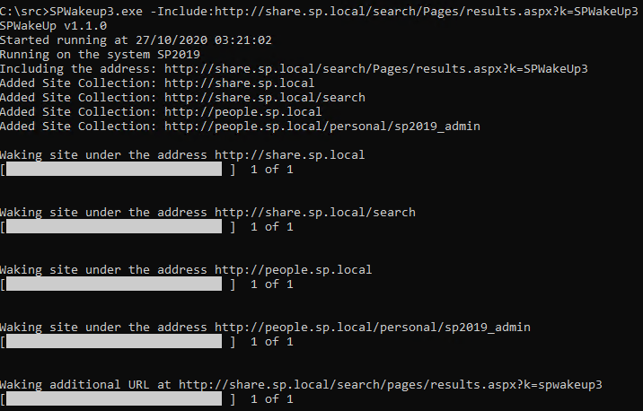

# SPWakeUp (SPWakeUp3)

SPWakeUp - Wake up your Sharepoint and WSS Sites

A simple command line application that touches each site collection and sub-site on a Sharepoint or WSS front-end server to rebuild the IIS cache.

---

**Note:** The original code is not mine, I'm providing this for those people still wanting to use SPWakeUp. If you own the original code and object to me hosting it here, please let me know.

This project was originally hosted at Codeplex. The archive is hosted at https://archive.codeplex.com/?p=spwakeup, the original source code for each release is also avaialble within the archive file that can be downloaded from that location.

SPWakeUp was originally provided for SharePoint 2007. It was also made available for SharePoint 2010. I provided builds for SharePoint 2013 and 2016. I have used SPWakeUp numerous times and found it to be a simple and reliable solution to wake up a SharePoint on-premises farm before users start accessing it for the day.

If you wish to compile SPWakeUp yourself, please follow the information in [Build-it-yourself.md](Build-it-yourself.md).

---

**New version released**: V1.1.0 includes the ability to include specific URLs in the list of URLs to be woken.

[Releases](https://github.com/Andy-Dawson/SPWakeUp/releases) contain binaries compiled for SharePoint 2013, SharePoint 2016 and SharePoint 2019.

Running SPWakeUp without any options will search for and find all Web Applications on your farm. Each Web App will in turn be searched for Site Collections and Sub-Sites. Once a list of every URL is built, spwakup will open an HTTP connection to each in turn. This rebuilds the caches on the server which improves performance for subsequent visits.

THe following screenshot shows SPWakeUp v1.1.0 running on a simple SharePoint 2019 farm:

You'll generally want to schedule SPWakeUp to run once a day on your front end servers sometime after IIS has been reset. I usually schedule all of the content application pools to recycle at the same time and then schedule SPWakeUp to run on each front end server one minute later. You should avoid times when other activities will be going on (e.g. backups) as SPWakeUp can cause significant server load while it runs. If you have more than one front end server in your farm and are using load balancing, you should also use entries in each server's hosts file to point each web application URL at the local server's IP address to ensure that all front end servers get owken up.

Available run-time options are:

-Exclude: Excludes the listed Site Collection URL from being woken.  
Can be used more than once. Example: SPWakeUp3.exe -Exclude:http://sharepoint.domain.com/sites/SC1 -Exclude:http://sharepoint.domain.com/sites/SC2  
This example would exclude the two listed site collections and everything underneath them from being woken.  

-Include (new for v1.1.0): Includes the URL in the list of URLs to be woken. Note that this can also be used to wake a specific URL on another system (as long as the account that is being used has access).  
Can be used more than once. Example: SPWakeUp3.exe -Exclude:http://sharepoint.domain.com/sites/SC1 -Include:http://sharepoint.domain.com/sites/SC1/SubSite1  
This example would exclude the site collection listed and everything underneath it, with the exception of the SubSite1 subsite which would be woken. Note that at present only the specific URL specified by the -Include paramter would be woken. If you require subsites beneath this to also be woken, they must also be specified.

-Email: An email address that should be sent a log of the results.  
**Note**: The implementation currently uses SharePoint's e-mail configuration to send e-mail. To send e-mail you should have configured SharePoint's outgoing e-mail and have ensured that the configuration is functional. Use of SPWakeUp3 on a system not running SharePoint will mean that e-mail notifications will not work.

-UserName: Name of the account that should be used to browse the sites. If no user name is set, sites are accessed under the current account. This option must be used in conjunction with the -Domain and -Password options.  
-Domain: The domain of the account specified above.  
-Password: The password that should be used to browse the sites.

-Authentication: The type of authentication used to browse the sites. Default value is NTLM.

-Verbose Shows the old-style verbose interface.