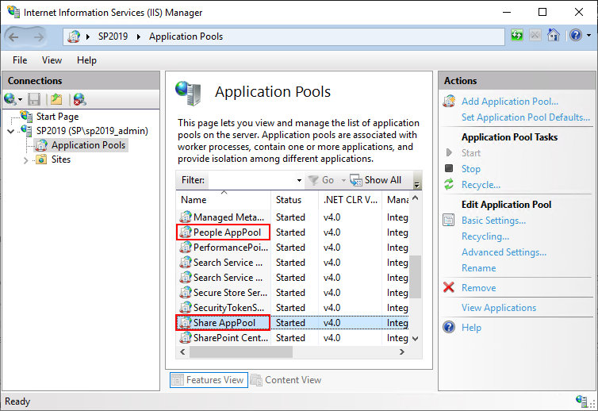
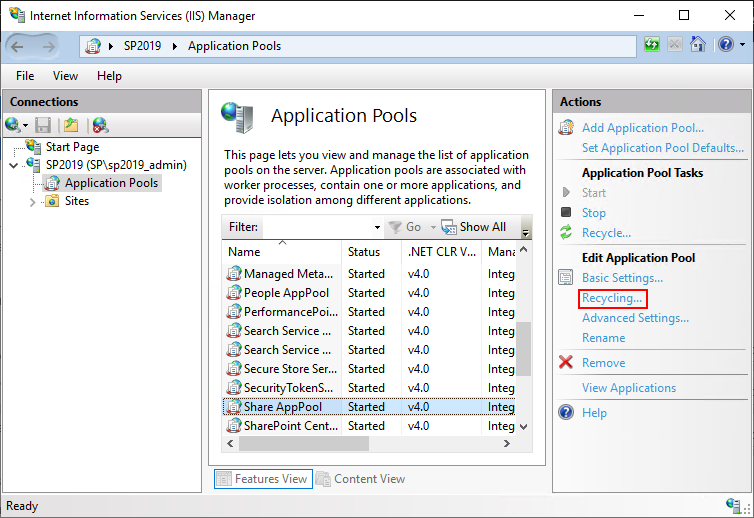
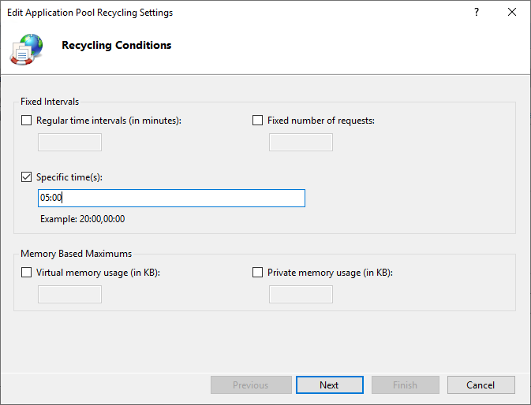
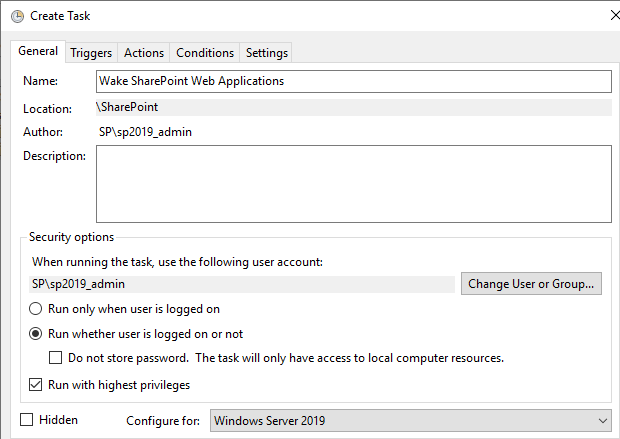
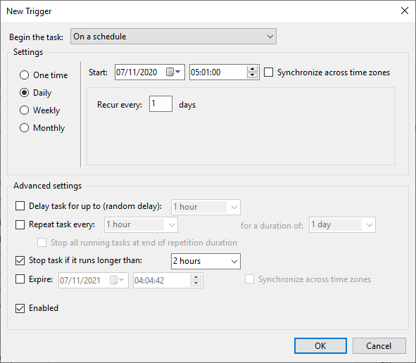
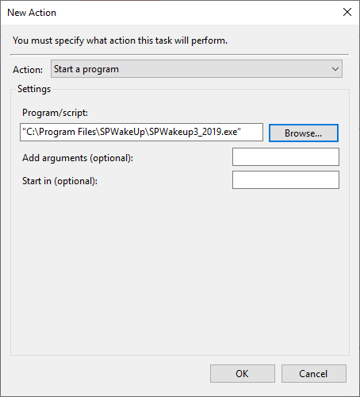

# SharePoint Configuration

SharePoint's default configuration for content Application Pool recycling is to recycle its content Application Pools at a specific time that has been randomly allocated during the creation of the web applications. The default times are usually early in the morning local time. This typically means that the first user to access each site after the content Application Pool serving that web application has been recycled gets a less than optimum experience as they have to wait as SharePoint pre-compiles the page they are accessing before serving it. In order to provide the best experience for the end users, the content Application Pools should be recycled at a time when (ideally) nobody is using SharePoint, and woken to pre-compile the pages before users need to access the system.

To configure your SharePoint servers to recycle the content Application Pools at a known time and to be woken up by SPWakeUp immediately afterwards, follow the steps below:

1. Identify your front end SharePoint server(s). Configuration is required on the servers performing the front end server role as these are the ones serving content pages to your users. Depending on your farm topology, thyis may be a single server, or multiple servers behind a load balancing solution.

2. Identify a suitable time to recycle the SharePoint content Application Pools and trigger SPWakeUp to wake them up. Ideally you should avoid times when users will be actively using SharePoint, backups will be running etc. For the majority of organisations this is usually a little while before the first users want to access SharePoint when they arrive in work in the morning.

3. On your front end servers, open IIS Manager and identify the content Application Pools. In the image below, the content Application Pools are 'People AppPool' (for the OneDrive for Business web application) and 'Share AppPool' (for the main content web application). Yours are likely to be named differently and you may have additional Application Pools.  

4. Select one of the content Appliacation Pools and click 'Recycling...' from the Actions manu at the right (NOT 'Recycle...' as that will immediately recycle the Application Pool).  

5. Configure the specific time at which the content Application Pool should recycle based on the time you identified during step 2, above. In the example below I have selected 5am:  

6. Leave the other options at their defaults and click 'Next' to go to the next dialog screen, then 'Finish' to complete the configuration.

7. Repeat these steps for the other content Application pools to ensure that they all recycle at the same time.

8. If you have multiple front end servers utilising a load balancing solution, you should also configure the hosts file for each server to point requests from the local server to the content web applications to the non-load balanced IP address of the server/web application. This ensures that as SPWakeUp runs, requests do not go through the load balancer, but instead are directed at the local server. This ensures that each front end server is woken rather than run the risk of one server being woken multiple times as traffic goes through the load balancer while other servers are not woken at all.

9. Copy the appropriate version of SPWakeUp into a known location on the front end server. I usually use '%ProgramFiles%\SPWakeUp' as this ensures that it will not be accidentally deleted during a server cleanup.

10. Create a scheduled task in Task Scheduler to wake the SharePoint content web applications immediately after the content Application Pools have been recycled. I usually create a new folder to store the scheduled tasks in to identify its purpose. Note that this scheduled task needs to be run as a user with full access to the farm, e.g. the SharePoint farm account. Configure the scheduled task as follows:  
    1. On the 'General' tab, provide a name (e.g. Wake SharePoint Web Applications), select 'run whether user is logged on or not', tick the 'run with highest privileges' checkbox and ensure that the 'Configure for' drop-down is set to the highest version supported by the server the task is running on:  
      
    2. On the 'Triggers' tab, click 'New' and on the 'New Trigger' dialog select 'On a schedule' from the drop-down at the top of the page, 'Daily' and set the trigger time to be one minute after you set the Application Pools to recycle (in my case this would be 5.01am) and set the task to stop running after a sensible period of time if it runs over (e.g. 2 hours):  
      
    You can also configure a trigger to perform a wake up after the server reboots here as well. For this, select 'At startup' from the available drop-down options, but I'd recommend setting a delay of several minutes to ensure that all services on the server are running before triggering a wake up.
    3. On the 'Actions' tab, click 'New' and provide the location of the SPWakeUp application. Unless you want to provide additional URLs to be woken, no other arguments are required:  
      
    4. Ensure that the settings on the 'Conditions' tab meet your need. I don't usually modify the settings on this tab.  
    5. On the 'Settings' tab ensure that the 'Run task as soon as possible after a scheduled start is missed' checkbox is selected and that the 'Stop the task if it runs longer than' value is the same as you set on the Triggers tab.  
    6. Click OK and enter the password for the account (and username if configuring for a different account to the one used to configure the task, remember that the account used must have full farm access).

11. Repeat these steps on the other front end servers in the SharePoint farm that you identified.

You should now find that the content Application Pools all recycle at the specified time and that a minute later SPWakeUp runs to wake all of the content sites ready for your users to access them. This should improve the experience for your end users (in particular for the first person to access each site in the morning). On my test system for example, the initial page load time for the SharePoint homepage went from one minute twenty seconds when SPWakeUp was not used to approximately one second after it had been used!
